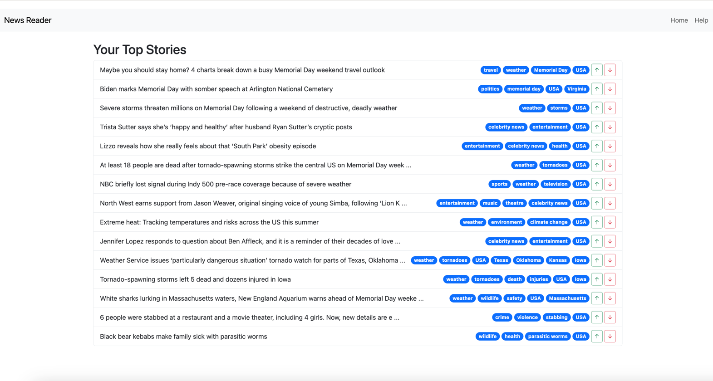
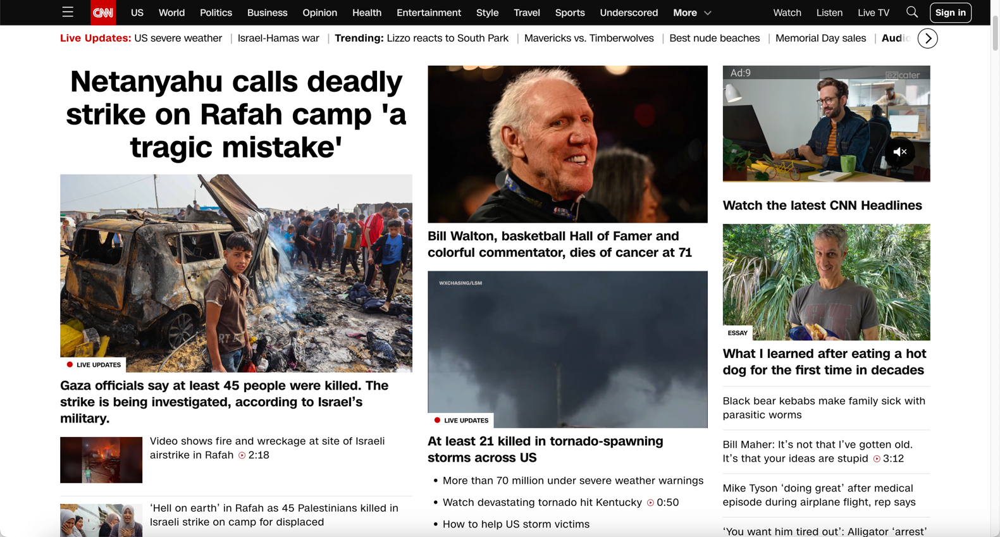
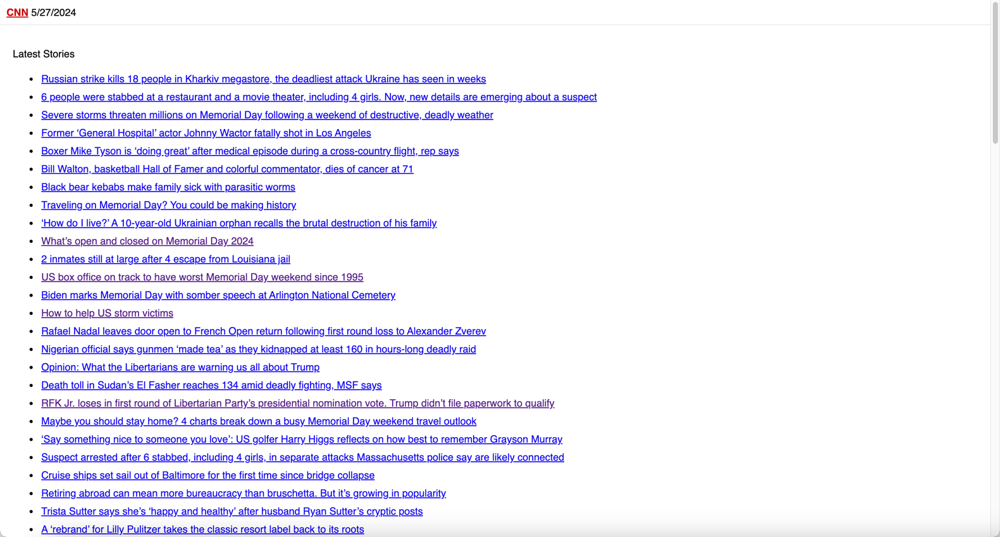

# News Reading Demo

When you hit the home page of any news site – NY Times, WSJ, CNN, etc. – the stories they show you are what they think are the most important.  Not what they think you think are the most important: what they think are most important.

But what if you want a news feed that is somehow prioritized for your interests?

That's what this application does, albeit in a simplisitic fashion.  It's meant to be a demonstration of LLMs (and even local LLMs) first and foremost, so there's a lot of corners that have been cut.  A lot.

Here's the UI that is generated:

The "badges" (text in blue pill-shaped ovals) contains the keywords extracted from the story (more on that later), the up and down arrows allow you to indicate how much you want to see articles like this in your feed.  If you clock on the headline, you are taken to the actual story and it assumes you "liked" the story.  It also notes that you've read the story, and will not show it again.

As time progresses, the system will start to learn which keywords you are interested in and which you are not, and prioritize the list appropriately.

There's a lot more this UI can do, but it's meant to be a demo, so it has a MVP-ish quality to it.

## Theory of Operation

Most news sites look something like this:

In theory you could parse this and extract the headlines. But CNN offers a text-only website that looks like this:

Which makes it really easy to extract the headlines. ( If you click though to an article, it's in all text as well.  No adverts, no clutter.  It's Web 1.0 and it's great!).

The application reads in the headlines, and uses an LLM to assign tags to each one (the blue pill shaped icons in the UI).  Note that it does not fetch the articles, so the tags are based purely on the headline text.  The tags are then used to rank the articles, as the application remembers, over time, which tags were in articles the user read (or liked) and which were in articles the user disliked.  

The theory is that, over time, the application will build up enough knowledge about the user's likes and dislikes that it does a pretty good job of sorting the incoming news.

## Installation

You'll need to clone the repo locally and install the requirements as given in requirements.txt

## Configuration

The application supports four different APIs (which you can modify in source code):

* Ollama, running Microsoft's phi3:mini
* Hugging Face, using their free, serverless API to run the LLama3:8B-Instruct model
* Anthropic, using their dirt cheap (but not free), Claude Haiku model
* Groq, using their API which can be free and severely rate limited, or dirt cheap

As Meatloaf once sang,  *two out of three, free, ain't bad*. (1)

The program is configured via environment variables:

| Name              | Description                                                  |
| ----------------- | ------------------------------------------------------------ |
| LLM_SERVICE       | Indicates which service you want to use. Legal values are (all lowercase): `ollama`, `huggingface`, `groq`, and `anthropic`.  The default is `ollama`, as this allows you to run the application without any environment variables set (assuming `ollama` is working.) |
| ANTHROPIC_API_KEY | If you are using Anthropic, you'll need to get an API key to access their services.  Use this environment variable to pass it into the code. |
| HF_API_KEY        | If you are using Hugging Face, you will need one of their API keys (which they call an *Access Token*) |
| GROQ_API_KEY      | Your API key for GROQ, if you're using it                    |

## Running

Once everything is configured, just run `python app.py`.  

## Notes

* If Ollama is not able to use the GPU in your system, it will be unbelievably slow.
* You can modify the source code to try other models.
* Hugging Face's free API is rate limited; you might consider their $9/month "Pro" subscription to get the limits raised.
* There's a tuning for the batch size for each type of service; I've set it to what seems to work for me.  You can modify it as you see fit (`get_batch_size()`).
* If you use Groq with a free plan and use Llama3 70B, it's going to rate limit fairly quickly and the initial processing of articles will run a bit slowly.

------

(1) That joke worked when I had three LLMs supported, not four.  Sorry.
